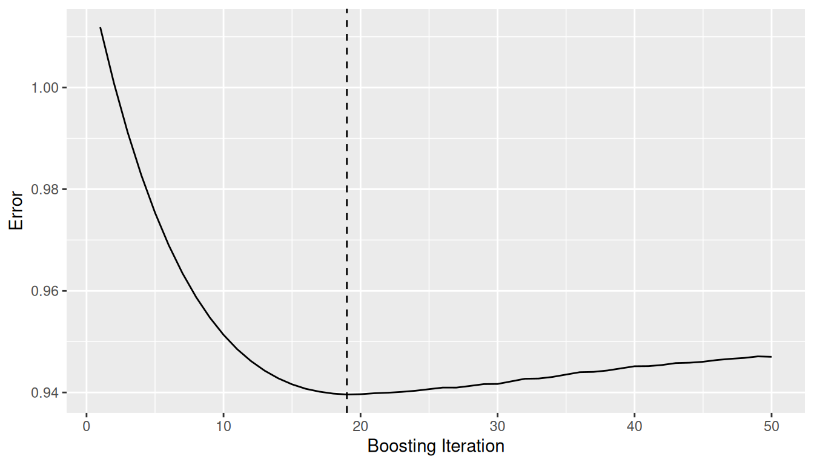
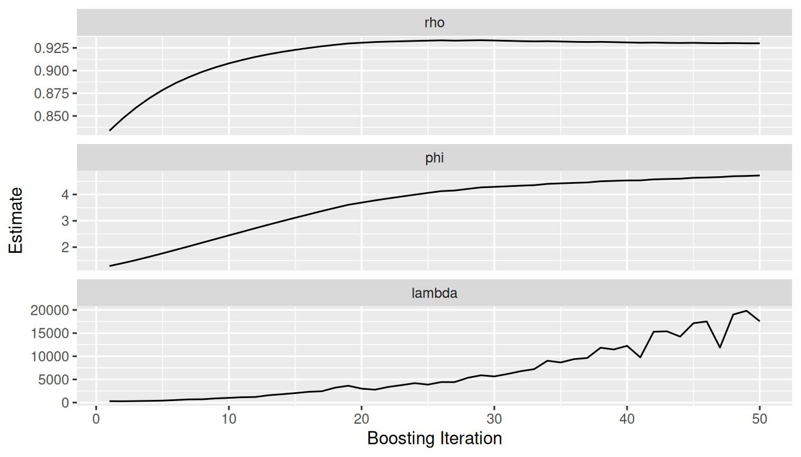
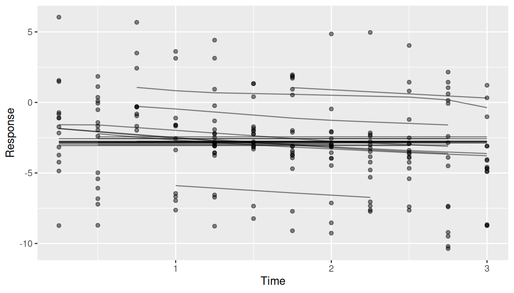
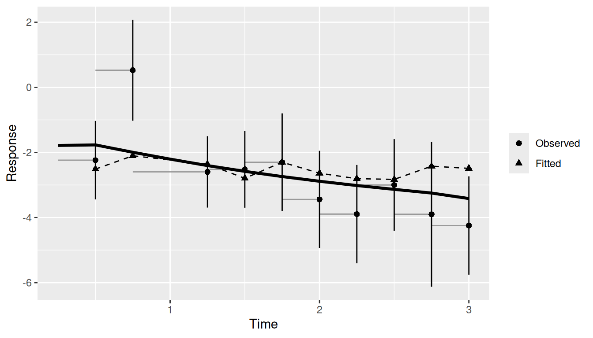
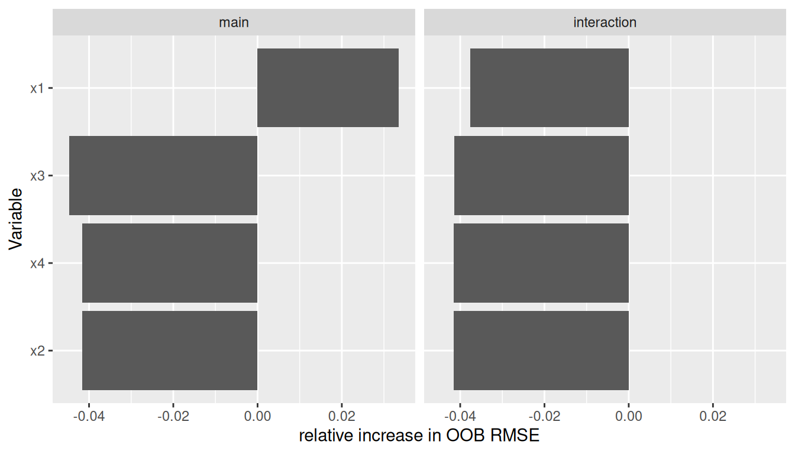
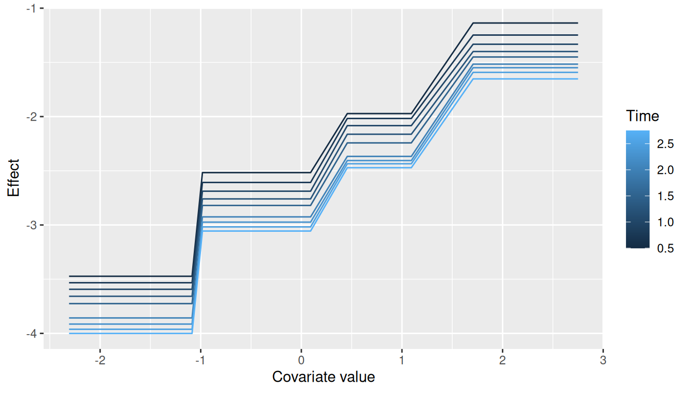
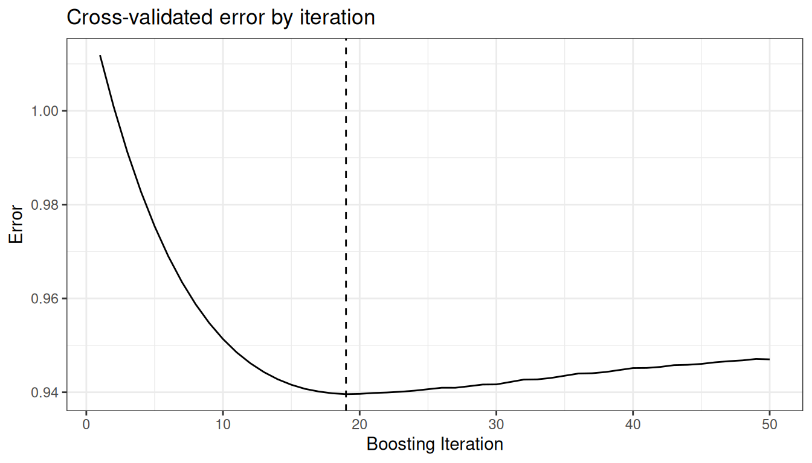

# Getting Started with ggBoostedTrees

## What is this package for?

If you have grown a random forest with `randomForestSRC`, you have
probably reached for `ggRandomForests` to look at it: an error curve to
see whether the forest has enough trees, an importance plot, a partial
dependence plot or two. ggBoostedTrees gives you the same set of figures
for a boosted tree model of a longitudinal outcome, fit with
`boostmtree`.

Boosting adds a few questions a forest never raises. A boosted model is
grown one small step at a time, so you need to know where to stop it.
`boostmtree` also estimates a within-subject correlation and a smoothing
penalty as it goes, and those should settle before boosting stops. And
because the response is measured repeatedly on the same subjects, the
figure you most want is the one that puts a subject’s fitted curve next
to their observed values.

This vignette is for the biostatistician who already knows R and ggplot2
and has a `boostmtree` fit (or is about to make one). It walks one small
simulated example from the fit to every figure the package draws, in the
order you would look at them.

## How is a figure built?

Every figure comes from two steps. An extractor, one of the
`gg_boost_*()` functions, pulls a tidy data frame out of the fitted
model. Then
[`autoplot()`](https://ggplot2.tidyverse.org/reference/autoplot.html)
(or its alias [`plot()`](https://rdrr.io/r/graphics/plot.default.html))
draws that data frame and hands you back a bare ggplot.

The split is deliberate. The data frame has a documented column
contract, so you can read the numbers behind a figure, test them, or
reshape them before anything is drawn. And because the renderer reads
only that data frame, never the fit, a second modelling backend needs
new extractor methods and nothing else. That is how `BoostMLR` fits came
to be supported.

## A small fit

We simulate 25 subjects with up to four visits each, using `simLong()`
from `boostmtree`. Model 1 builds the response from `x1`, `x3` and `x4`,
plus an interaction between time and `x2`, so we know what a sensible
fit ought to find. Fifty boosting iterations is enough to make the point
and fits in about a second.

``` r

library(ggBoostedTrees)
library(ggplot2)

set.seed(7)
sim <- boostmtree::simLong(n = 25, n.time = 4, model = 1)$data.list

fit <- boostmtree::boostmtree(
  x = sim$features, tm = sim$time, id = sim$id, y = sim$y,
  M = 50, cv.flag = TRUE, verbose = FALSE,
  control = boostmtree::boostmtree.control(seed = 7)
)
```

`cv.flag = TRUE` matters here. `boostmtree` records the error path and
the cross-validated optimal iteration (`m.opt`) only when
cross-validation ran. A fit grown without it has no error path to draw,
and
[`gg_boost_error()`](https://ehrlinger.github.io/ggBoostedTrees/reference/gg_boost_error.md)
will tell you so rather than draw something misleading.

## Did it converge?

The error path is the first thing worth looking at, so a fitted model
goes straight to it:

``` r

autoplot(fit)
```



The dashed line marks the optimal iteration. Error that falls and then
flattens well before the last iteration says `M` was large enough. If
the curve is still falling at the right edge, grow more iterations.

The shortcut hides the first step. Written out, it is the extractor and
then the renderer, and the extractor’s result is an ordinary data frame:

``` r

gg_dta <- gg_boost_error(fit)
head(gg_dta, 3)
#>   iteration     value response optimal
#> 1         1 1.0118738        y   FALSE
#> 2         2 1.0008788        y   FALSE
#> 3         3 0.9912097        y   FALSE
```

The `optimal` column flags the row for `m.opt`. Everything else in the
package follows this pattern.

## Did the variance structure settle?

`boostmtree` re-estimates three parameters as it boosts: `rho` (the
within-subject correlation), `phi` (the variance component) and `lambda`
(the P-spline smoothing parameter for the time interaction).
[`gg_boost_path()`](https://ehrlinger.github.io/ggBoostedTrees/reference/gg_boost_path.md)
tracks all three by iteration:

``` r

autoplot(gg_boost_path(fit))
```



Each parameter gets its own panel on a free y scale, because the three
can sit orders of magnitude apart. What you want to see is each path
levelling off. A parameter still drifting at the last iteration means
the variance model had not caught up with the mean model when boosting
stopped.

## Does it track individual subjects?

This is the figure longitudinal boosting exists for. A model can match
the population mean well and still miss most individual subjects.
[`gg_boost_trajectory()`](https://ehrlinger.github.io/ggBoostedTrees/reference/gg_boost_trajectory.md)
puts each subject’s fitted curve (lines) over their observed values
(points):

``` r

autoplot(gg_boost_trajectory(fit))
```



With a few hundred subjects the plot turns to spaghetti.
[`autoplot()`](https://ggplot2.tidyverse.org/reference/autoplot.html)
draws at most `n_max` subjects (100 by default) and scales the
transparency to the number drawn. Use `subset` to name the subjects you
want to look at.

## Does it match the data over follow-up?

The trajectory plot shows subjects one at a time. The calibration figure
summarizes all of them at once: observations are grouped into time bins
with roughly equal counts, and each bin shows the mean observed value
with a 95% interval next to the mean fitted value at the same
observations.

``` r

pred <- predict(fit, x = fit$x)
autoplot(gg_boost_calibration(fit, pred = pred))
```



Passing `pred` adds the cohort’s mean predicted curve (the solid line).
The interval treats observations as independent, which repeated
measurements are not, so it is too narrow. Read it as a visual guide,
not a test. The extracted data frame also carries `n_subject` per bin,
which is where to look when a late bin rests on a handful of subjects.

## Which covariates matter, and how?

Variable importance comes from `boostmtree` itself.
[`gg_boost_vimp()`](https://ehrlinger.github.io/ggBoostedTrees/reference/gg_boost_vimp.md)
takes the output of `vimp.boostmtree()` and splits importance into the
covariate’s main effect and its interaction with time:

``` r

set.seed(7)
vimp <- boostmtree::vimp.boostmtree(fit)
autoplot(gg_boost_vimp(vimp))
```



Don’t read too much into importance from 25 subjects. The values are
noisy at this size. A value below zero means permuting that covariate
did not make the error worse, so the model is not leaning on it. Here
only the main effect of `x1` clears zero, and the simulation did give
`x1` the largest coefficient.

To see the shape of an effect rather than its size, ask `boostmtree` for
a partial effect and hand the result to
[`gg_boost_effect()`](https://ehrlinger.github.io/ggBoostedTrees/reference/gg_boost_effect.md):

``` r

pp <- boostmtree::partial.plot(
  fit, x.var.names = "x1", output = "data", verbose = FALSE
)
autoplot(gg_boost_effect(pp))
```



Each curve is the partial effect of `x1` at one time point, coloured by
time. The response rises with `x1`, in steps, because the base learners
are trees. The vertical gap between curves is the time trend. Curves
that stay roughly parallel, as these do, say the effect of `x1` does not
change much with time; a covariate with a strong time interaction draws
curves that change slope from one time to the next.
[`gg_boost_effect()`](https://ehrlinger.github.io/ggBoostedTrees/reference/gg_boost_effect.md)
accepts `marginal.plot()` output in the same way.

## Finishing a figure

[`autoplot()`](https://ggplot2.tidyverse.org/reference/autoplot.html)
returns a bare ggplot, so you finish it with `+` the way you would any
other:

``` r

autoplot(gg_dta) +
  theme_bw() +
  labs(title = "Cross-validated error by iteration")
```



Swap in the `hvtiPlotR` theme here for a figure in house style.

## What about BoostMLR?

All six figures also accept a `BoostMLR` fit. Partial effects go through
[`boostmlr_partial()`](https://ehrlinger.github.io/ggBoostedTrees/reference/boostmlr_partial.md),
since `BoostMLR`’s own partial-effect output arrives without covariate
or response names. The support is partial on purpose: marginal effects
and joint importance are not available for `BoostMLR`, and the
extractors stop with an error rather than guess.

## Where to go next

The [function
reference](https://ehrlinger.github.io/ggBoostedTrees/reference/) is
arranged in the same order as this vignette’s workflow:

- **Extract** holds the `gg_boost_*()` extractors and
  [`boostmlr_partial()`](https://ehrlinger.github.io/ggBoostedTrees/reference/boostmlr_partial.md),
  each documenting the columns of the data frame it returns.
- **Render** holds the
  [`autoplot()`](https://ggplot2.tidyverse.org/reference/autoplot.html)
  method for each extracted class, with the arguments that control the
  drawing (`subset` and `n_max` for trajectories, for example).
- **Shortcut** holds
  [`autoplot.boostmtree()`](https://ehrlinger.github.io/ggBoostedTrees/reference/autoplot.boostmtree.md),
  the jump from a fit to its error path.

For random forests, the same idiom is in
[ggRandomForests](https://github.com/ehrlinger/ggRandomForests).
